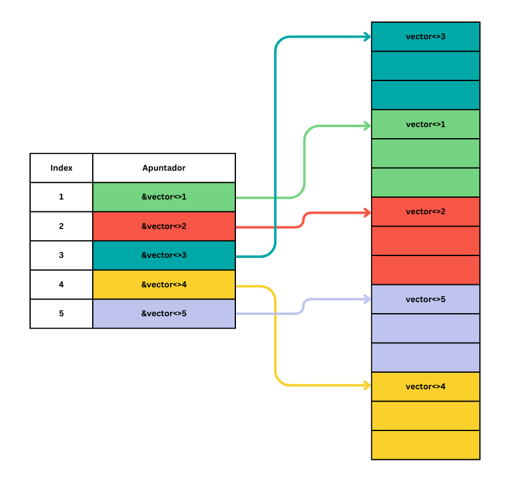

# Proyecto: Nombre de tu proyecto
La idea principal del proyecto es que el usuario puede cargar un serie de datos en formato CSV. Los datos para la 'aplicación' sera parecido a un tracker de música, como con Scrobbles de [Last.FM](https://www.last.fm/about/trackmymusic). El usuario podra ingresar otros numeros a la lista, y con cada jugada se incrementa la cantidad de veces que se ha escuchado al canción. Luego, el usuario podrá mirar a los canciones a cual escuchan más.

## Descripción del avance 1
El primer avance is puro un algoritmo de ordenamiento. Como estamos trabajando con un serie de strings en un array 2D, tenemos que seleccionar cual columna quieremos usar para ordenar. Ademas, strings son ordenados lo mas eficiente con uso de radix sort, que tiene una complejidad de tiempo de `O(nk)`, donde `n` es la cantidad de datos y `k` es la cantidad de elementos en el string mas grande. Por eso es muy eficiente, como se trabaja en (casi) una forma linear. Si `k = n`, pues tenemos una complejidad cuadratica, pero eso sera muy dificil en un gran almacen de datos.

Al momento, el primer avance solo ordena la columna seleccionada en forma ascendiente. Esto lo quiero cambiar para que el usuario puede ordenar en cualquier dirección ellos quieren. Ademas quiero agregar la posibilidad de filtrar datos. Para el momento usamos un array 2D nombrado en el codigo, pero tambien aquí quiero agregar funcionalidad para que el usuario selecciona el archivo.

Funcionamiento basico del codigo fuente es lo siguiente: el almacen de datos se interpreta como una array 2D. Cuando el usuario elige una columna para ordenar, la programma no cambia el array original, pero cambia un otro array donde se guardan los indices. Con eso, guardamos los datos originales para que si hacemos un error sera posible volver al estado original (aún esto todavía se tiene que integrar).

## Descripción del avance 2
Este avance agrega una estructura de datos para guardar los datos de la aplicación. Las estructuras escogidos fueron un `unordered_map` y un `stack`. Estos son dos estructuras muy eficientes en su complejidad de tiempo. Opino que, ademas el `unordered_map` es una estructura eficiente para la meta de la aplicación, cual se explica más en el parte abajo.

En el avance, solo trabaje en la mapa para guardar, leer, ingresar, y cambiar datos. No pude agregar la funcionalidad del primer avance adentro de este como no tení suficiente tiempo este ciclo para trabajar en ello. Con el tercer avance voy a trabajar más en ella y también para arreglar los errores del primer avance que me occurieron.

Un otro elemento en cual trabaje un poco fue el archivo `readCSV.h` para leer los datos. Aquí tome inspiración de algún repo, aún no recuerdo cual al momento y lo voy a buscar para la entrega final. Cambié algunos elementos para que se funciona a la manera que quiero para la aplicación final.

Se puede cambiar el `main.cpp` para hacer más casos de prueba. Al momento el `main.cpp` solo ingresa los datos del archivo `rock-songs.csv` y hace una prueba de ingresar un elemento con la cantidad de filas incorrecto.

Ya hay alguna manera de manejar con los errores que pueden salir de la programa, aún voy a cambiar estos para la aplicación final para que solo se da un error y no cierra la aplicación. Estos son algunos cosas que quiero cambiar cuando tengo más tiempo.

### Cambios sobre el primer avance
1. Gran cambio al primer avance para intentar de manejar errores. Cuando estuvo connectando al primer avance con la segunda, estuvo saliendo con el proximo error en el debugger:

`warning: Critical error detected c0000374`
`Thread 1 received signal SIGTRAP, Trace/breakpoint trap.`

Hice varios cambios sobre el primer avance, en algunas partes con ayuda de Claude3.5 para ayudarme como nunca habia vista este error. En realidad los cambios ayudaron para evitar que la programa quebro pero al momento destruyo la funcionamiento del primer avance.

### Cambios sobre el segundo avance
1. Cambio en la logica de `insertRow` para añadir la primera fila. Esto no lo había visto en la entrega del segundo avance, por lo cual se cambio ahora.
1. Cambio de `getCell` en donde se devuelve un valor vacia en caso de una celda incorecta. Esto da la opción para evitar algunas errores directamente desde el `main.cpp`.
1. Cambio minima in `printRow` para hacerlo más lindo en imprimiendo las filas.
1. Saque de exceptions para evitar que la programa rompe cuando el usuario hace un error. Ahora funciona con otra forma de manejar a los errores.

## Descripción de la entrega final
La entrega final consiste de una aplicación entera en forma de un "Command Line Interface". El usuario puede importar datos, crear nuevas listas, añadir canciones, y reproducirlos desde su browser primaria. Cada vez que el usuario reproduce una canción, se incrementa el valor de "Play Count" en la lista. La idea primaria es que se ordena la lista para que la canción con la mayor cantidad de jugadas esta al principio de la lista. La problema aquí es que cambios al `radixSort.h` para conectarlo a la estructura de datos no esta funcionando como esperado, por lo cual no se ordena la lista. Por eso vemos que la entrega final casi es lo que queria alcanzar con este proyecto.

## Instrucciones para compilar el avance de proyecto
Ejecuta el siguiente comando en la terminal:

`g++ -std=c++14 header.h address.h readCSV.h  radixSort.h writeCSV.h main.cpp -o musicList` 

## Instrucciones para ejecutar el avance de proyecto
Ejecuta el siguiente comando en la terminal:

`./musicList` 

## Descripción de las entradas del avance de proyecto
Cuando el usuario empieza la programa, de forma immediata se empieza a preguntar al usuario para una entrada. Aquí el usuario puede elegir de varios funciones para usar a la aplicación. Estos estan adentro de la función `help` pero lo añado aquí para leerlo.

`"help: Show this help message"`

`"read <filename>: Read a CSV file and update the song list"`

`"newList <filename>: Create a new song list"`

`"newSong: Add a new song, will prompt the user"`

`"removeSong <index>: Remove a song at the given index"`

`"play <index>: Play the song at the given index"`

`"save <filename>: Save the current song list to a CSV file"`

`"exit: Exit the program"`

## Descripción de las salidas del avance de proyecto
La salida de la programa es un enlace CSV con la lista del usuario. El usuario tambien se puede imprimir filas mientras esta usando a la programa.

## Desarrollo de competencias

### SICT0301: Evalúa los componentes
#### Hace un análisis de complejidad correcto y completo para los algoritmos de ordenamiento usados en el programa.
Como indicado en la descripción del avance 1, explico que el radix sort, el algoritmo de ordenamiento usado, tiene una complejidad de `O(nk)` en el peor de los casos, donde `k` es es el numero de elementos en el string mas largo. Al razon por cual tiene que ver con esta complejidad lo explico mas abajo:

1. Empezamos con el array desordenado.
1. El algoritmo mira al primer caracter del string, ordena el array a mano de esta caracter.
1. Si hay dos o mas strings con el mismo caracter, lo compara estes dos de la misma forma, ahorra mirando al proximo caracter.
1. Continua esto recursivamente hasta que no puede ordenar mas.

En el mejor de los casos, todos los strings tiene un primer caracter unico y ya esta ordenado. Cuando esto pasa, solo hacemos un paso para asegurar que esta ordenado, por lo cual tenemos un caso mejor de `O(n)`. En el caso que tenemos `n` strings de `k` elementos que son iguales hasta el ultimo elemento, tenemos un caso peor de `O(nk)`.

#### Hace un análisis de complejidad correcto y completo de todas las estructuras de datos y cada uno de sus usos en el programa.
Para la estructura de datos usamos un `unordered_map` y un `stack`, ambos cuales ya tienen funcionalidad en C++ pero a cual se agrego algunas funciones para este proyecto. Para el `unordered_map`, los proximos funciones tienen alguna funcionalidad de acceso o cambio a los datos.

1. `clear()`: Este función vacia los datos en la mapa. Para hacer esto tiene que pasar todo la lista para eliminar cada elemento. Esto significa que en todos los casos tenemos `O(n)` complejidad de tiempo.
1. `insertRow()`: Aquí ingresamos una fila a la lista de elementos. La mayoría del tiempo, hace comandos que son de orden `O(1)`. Aún, cuando ya se ingreso la primera fila, se compara el tamaño de la nueva fila con la fila primaria de la lista. Esto requiere complejidad `O(m)`, donde `m` es la cantidad de elementos adentro de una fila.
1. `getRow()`: Con el `unordered_map`, el caso promedio para buscar un elemento adentro de la lista es `O(1)`, pero en el peor de los casos se puede ir a complejidad de `O(n)`. En realidad, esto casí no pasa pero se puede ocurir.
1. `getCell()`: Como usa `getRow()` va a tener una complejidad muy parecida, con cual podemos decir que tiene `O(1)` en el caso promedio y `O(n)` en el caso peor.
1. `updateRow()`: También usa a `getRow()`. En todos los casos tenemos que cambiar todos los elementos en la fila. Por eso, en todos los casos tenemos complejidad `O(m)`. El caso promedio sera `O(m)` y el caso peor `O(m)` o `O(n)`, dependiendo de si `m > n` o `m < n`.
1. `updateCell()`: Como accedemos a la columna diréctamente con la índice de la columna, solo cambiamos el valor. Por eso tenemos una complejidad de `O(1)` para cambiar los valores.
1. `removeRow()`: Solo necesitamos eliminar el vector aquí y borrar su entrega en la lista. Por eso, es una función muy simple con complejidad `O(1)`.

Para el uso del `stack`, vemos que se fue implementado adentro de la función `insertRow()`. La funcionalidad primaria aquí es para ver si hay filas vacias adentro de la lista de elementos. Siempre llenamos la fila que se vacio primero, por cual un stack es la mejor implementación. Los stacks tienen una complejidad muy eficiente, con todos los funciones de un stack teniendo complejidad `O(1)`, por eso la complejidad del stack no tiene más efecto en la complejidad de `insertRow()`.

#### Hace un análisis de complejidad correcto y completo para todos los demás componentes del programa y determina la complejidad final del programa.
Escribe aquí tus argumentos sobre por qué consideras que has desarrrollado esta competencia y dónde se puede observar el desarrollo que mencionas.

### SICT0302: Toma decisiones
#### Selecciona un algoritmo de ordenamiento adecuado al problema y lo usa correctamente.
Para ordenar strings, el uso del algoritmo de radix sort de la forma explicado arriba me parece la mejor opción. Esta integración se llama MSD radix sort (Most Significant Digit), como empieza mirando al primer elemento de los strings. Usando LSD radix sort (Least Significant Digit), tendramos una complejidad temporal de `O(nk)` en cualquier de los casos (peor, promedio y mejor de los casos).

La unica mejora sera que tiene una complejidad de espacio mejor, de `O(n+B)`, donde `B=256` como es el radix de posibles caracteres. Para el MSD radix sort, sera una complejidad de espacio de `O(n+Bk)`. A cualquier caso, aquí sacrificamos un poco de espacio de memoria para mejorar nuestro tiempo de ejecución. Ademas, para ordenar strings, es mas logico para empezar al inicio del string, como ya podemos simplificar el proceso de ordenamiento si podemos eliminar strings del flujo de ordenamiento al inicio del algoritmo.

#### Selecciona una estructura de datos adecuada al problema y la usa correctamente.
Seleccioné la estructura del `unordered_map` y el `stack` por su eficiencia en tiempo. El `unorderd_map` es muy eficiente para acceder y cambiar elementos adentro de una lista de elementos. Esto significará que funciona muy bién con el algoritmo de ordenamiento que uso para compara los elementos. Luego, este tipo de estructura también me deja de guardar los datos dinámicamente en memoria. Como el base de datos se puede ponerse muy grande, es importante de dispersar a los datos. La lista solo apunta a la ubicación en memoria de un elemento, por lo cual el espacio continuo más grande que uso sera de `n` elementos en vez de `n*m` elementos. Un ejemplo se ve en la imagen por abajo.

    

El stack se uso para tomar en cuenta filas que se vacieron. Esto es una estructura muy eficiente para este implementación como discutimos en la parte de complejidades. Ademas, es la implementación más logico y simple para llegar al logro de este forma de guardar datos.

### SICT0303: Implementa acciones científicas
#### Implementa mecanismos para consultar información de las estructras correctos.
La mayoria de las funciones que se encuentran adentro de `main.cpp` son llamadas a otros funciones que fueron escritos la primera y segunda avance. Por eso, la mayoria de lo que fue escrito en este avance tiene complejidad de `O(1)`. Algunas partes pueden tener complejidad de `O(k)` o `O(n*k)`, donde pasamos los elementos de una fila, en cual caso tenemos `O(k)`, o todo los elementos de la mapa, en cual parte tenemos `O(n*k)`. Un ejemplo en la entrega final en donde se encuentra complejidad de `O(n*k)` sera en la el archivo de `writeCSV.h`, en donde tenemos que recorrer cada elemento de la estructura de datos para escribir los elementos al CSV. Tal vez seria más eficiente en una version futura de solo cambiar los elementos que han visto cambios mientras el usuario estaba usando a la programa.

#### Implementa mecanismos de lectura de archivos para cargar datos a las estructuras de manera correcta.
Uso del `readCSV.h` carga los datos a la estructura de datos. También carga la primera fila como un "header line" para imprimir, pero no tomar en cuenta con el algoritmo de ordenamiento. Me di cuenta de un error al final de escribir este documento, cual es que la primera fila no se carga de forma correcta. Esto lo arreglo con el próximo avance para que la problema no continua hasta la entrega final.

### Implementa mecanismos de escritura de archivos para guardar los datos  de las estructuras de manera correcta
Uso del `writeCSV.h` escribe los datos de la estructura de datos a una archivo CSV. El usuario puede escribir los datos con la función `save` en la programa, y revisar al archivo despues de cerrarlo. Vemos que esto funciona cuando escribimos los datos al CSV.